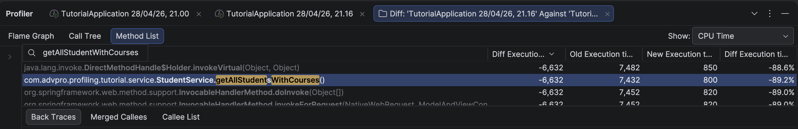
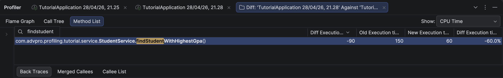

## Performance Testing Results

### Endpoint `/all-student`
#### GUI Result

#### CLI Result

### Endpoint `/all-student-name`
#### GUI Result

#### CLI Result

### Endpoint `/highest-gpa`
#### GUI Result

#### CLI Result

## Hasil JMeter Setelah Optimasi

### Endpoint `/all-student`

### Endpoint `/all-student-name`

### Endpoint `/highest-gpa`

## Kesimpulan
Setelah dilakukan optimasi, ketiga endpoint menunjukkan peningkatan performa yang signifikan, jauh melampaui target 20%:
- `/all-student`: meningkat ~93% (86335ms → 6308ms) dengan menghilangkan N+1 query problem menggunakan `studentCourseRepository.findAll()`
- `/all-student-name`: meningkat ~96% (3647ms → 142ms) dengan mengganti string concatenation menggunakan `Collectors.joining()`
- `/highest-gpa`: meningkat ~97% (855ms → 29ms) dengan menggunakan query level database melalui `findTopByOrderByGpaDesc()`

---

## Refleksi

### 1. Apa perbedaan antara pendekatan performance testing dengan JMeter dan profiling dengan IntelliJ Profiler?

JMeter dan IntelliJ Profiler itu saling melengkapi tapi fokusnya beda. JMeter lebih ke perspektif luar — kita simulasikan banyak user yang mengakses endpoint sekaligus, lalu lihat berapa lama response time-nya. Dari situ kita tahu apakah aplikasi bisa menangani beban atau tidak, tapi kita tidak tahu *kenapa* lambat.

Nah, di sinilah IntelliJ Profiler masuk. Setelah tahu dari JMeter bahwa `/all-student` butuh 86 detik, kita pakai profiler untuk lihat ke dalam — method mana yang memakan waktu paling banyak, berapa CPU time-nya, dan di baris kode mana bottleneck-nya terjadi. Jadi JMeter untuk deteksi masalah dari luar, profiler untuk diagnosis dari dalam.

### 2. Bagaimana proses profiling membantu mengidentifikasi dan memahami titik lemah aplikasi?

Profiling memberikan data yang sangat spesifik — bukan sekadar "aplikasi ini lambat", tapi "method `getAllStudentsWithCourses` menghabiskan 7432ms CPU time dan dipanggil ribuan kali". Dari flame graph kita bisa langsung lihat method mana yang "makan" paling banyak resource, dan dari method list kita bisa bandingkan total time vs CPU time untuk tiap method.

Tanpa profiling, kita hanya bisa menebak-nebak bagian mana yang perlu dioptimasi. Dengan profiling, kita langsung tahu harus fokus ke mana, sehingga waktu optimasi jadi jauh lebih efisien.

### 3. Apakah IntelliJ Profiler efektif dalam membantu menganalisis dan mengidentifikasi bottleneck?

Menurut saya cukup efektif. Flame graph-nya sangat membantu untuk melihat gambaran besar — method yang paling banyak mengonsumsi resource langsung terlihat jelas dengan ukuran blok yang lebih besar. Method list juga berguna karena bisa filter berdasarkan nama method dan langsung lihat CPU time-nya.

Yang paling berkesan adalah saat profiling `getAllStudentsWithCourses` — dari console Hibernate saja sudah kelihatan query yang sama diulang ribuan kali, dan profiler mengkonfirmasi bahwa method ini memang paling boros. Jadi tidak perlu tebak-tebakan lagi.

### 4. Apa tantangan utama saat melakukan performance testing dan profiling, dan bagaimana mengatasinya?

Tantangan pertama adalah hasil yang tidak konsisten antar run. Karena JIT compiler JVM belum optimal di run pertama, waktu eksekusi di awal selalu lebih lambat. Solusinya adalah jalankan beberapa kali dan ambil pengukuran dari run yang sudah "warm".

Tantangan kedua adalah menginterpretasikan hasil profiler. Awalnya bingung membedakan Total Time dan CPU Time, atau method mana yang perlu difokuskan karena banyak method dari framework yang juga muncul. Solusinya adalah filter hanya method dari package aplikasi sendiri dan fokus pada CPU time tertinggi.

### 5. Apa manfaat utama menggunakan IntelliJ Profiler untuk profiling kode aplikasi?

Manfaat terbesarnya adalah tidak perlu menambahkan kode tambahan apapun — cukup jalankan aplikasi dengan mode profiler, akses endpoint, lalu hasilnya langsung tersaji. Dibandingkan harus menambahkan logging manual atau instrumentasi kode, ini jauh lebih praktis.

Selain itu, integrasi langsung dengan IDE membuat proses debugging jadi lebih mudah. Setelah tahu method mana yang bermasalah, kita bisa langsung klik dan dibawa ke source code-nya tanpa perlu cari-cari dulu.

### 6. Bagaimana jika hasil profiling IntelliJ Profiler tidak konsisten dengan temuan dari JMeter?

Ini bisa terjadi karena keduanya mengukur hal yang berbeda. JMeter mengukur dari sisi network (termasuk latency, serialisasi response, dsb), sedangkan IntelliJ Profiler mengukur eksekusi kode di sisi server saja. Jadi wajar jika angkanya tidak sama persis.

Jika ada ketidakkonsistenan, pendekatan yang saya lakukan adalah percaya pada keduanya sesuai konteksnya — profiler untuk menemukan bottleneck di level kode, JMeter untuk memvalidasi apakah optimasi tersebut benar-benar berdampak pada response time end-to-end. Jika profiler menunjukkan improvement tapi JMeter tidak, kemungkinan bottleneck ada di bagian lain seperti network atau serialisasi.

### 7. Strategi apa yang diterapkan dalam mengoptimasi kode setelah menganalisis hasil performance testing dan profiling?

Strategi utama yang saya terapkan adalah fokus pada bottleneck terbesar terlebih dahulu. Dari profiling, `getAllStudentsWithCourses` jelas yang paling bermasalah karena N+1 query problem — setiap student memicu satu query ke database, sehingga dengan 20.000 student ada lebih dari 20.000 query. Solusinya adalah mengganti dengan satu query `findAll()` yang mengambil semua data sekaligus.

Untuk memastikan perubahan tidak merusak fungsionalitas, saya verifikasi response dari endpoint tetap sama sebelum dan sesudah optimasi. Setelah optimasi, data yang dikembalikan tetap berisi pasangan student dan course yang benar, hanya saja jauh lebih cepat. Pengukuran ulang dengan JMeter juga mengkonfirmasi bahwa improvement nyata terjadi di semua endpoint.

