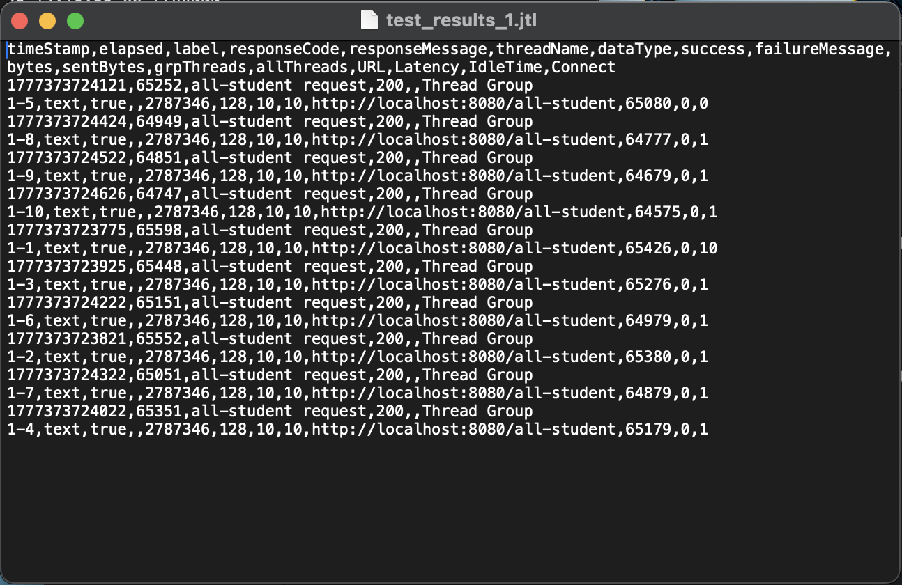
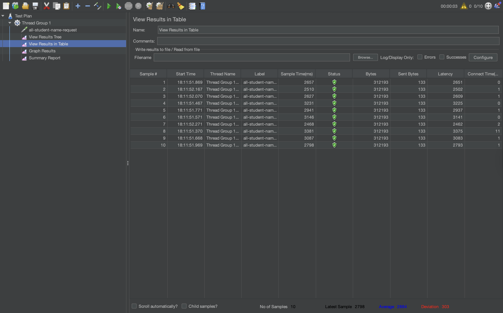
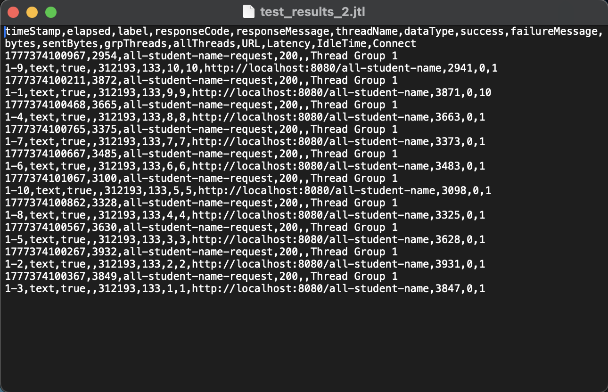
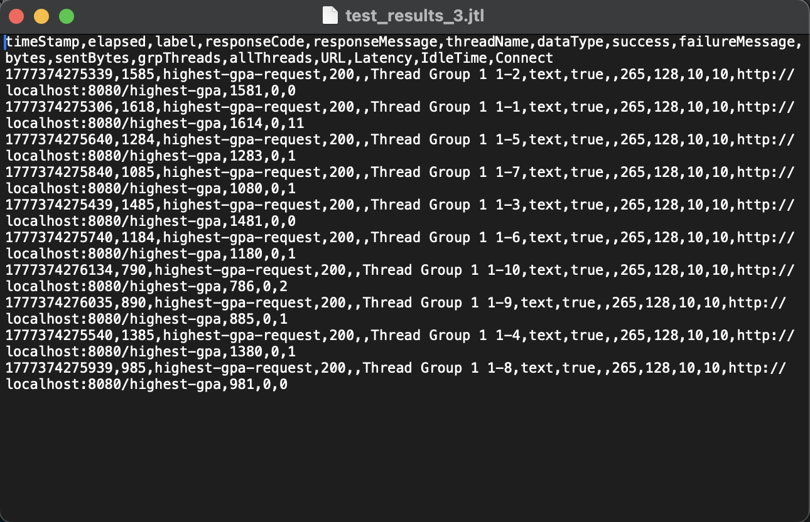
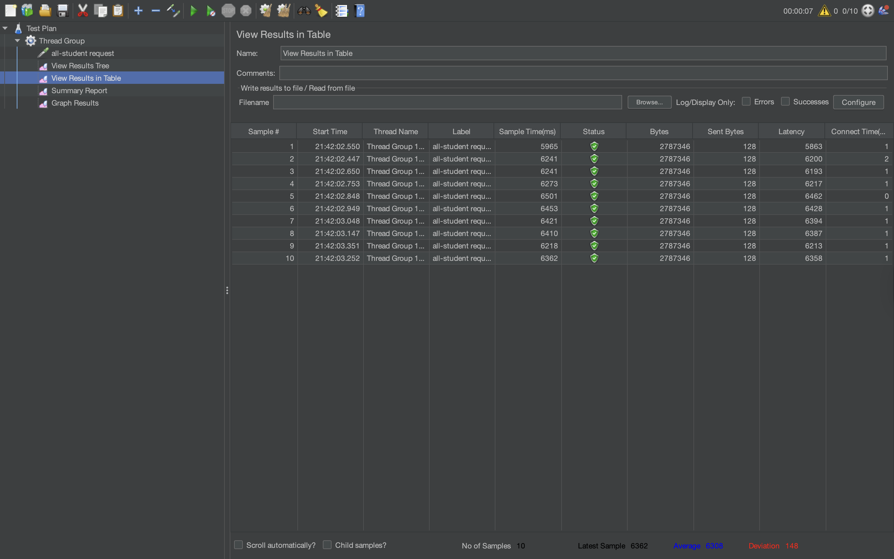
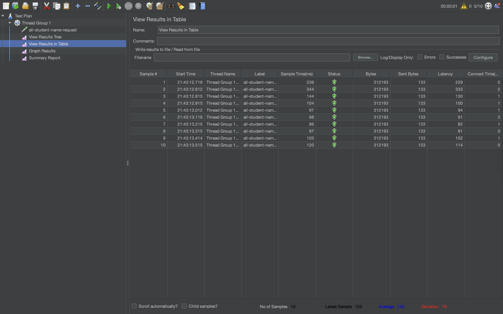

## Performance Testing Results

### Endpoint `/all-student`
#### GUI Result

#### CLI Result

### Endpoint `/all-student-name`
#### GUI Result

#### CLI Result

### Endpoint `/highest-gpa`
#### GUI Result

#### CLI Result

## Hasil JMeter Setelah Optimasi

### Endpoint `/all-student`

### Endpoint `/all-student-name`

### Endpoint `/highest-gpa`

## Kesimpulan
Setelah dilakukan optimasi, ketiga endpoint menunjukkan peningkatan performa yang signifikan, jauh melampaui target 20%:
- `/all-student`: meningkat ~93% (86335ms → 6308ms) dengan menghilangkan N+1 query problem menggunakan `studentCourseRepository.findAll()`
- `/all-student-name`: meningkat ~96% (3647ms → 142ms) dengan mengganti string concatenation menggunakan `Collectors.joining()`
- `/highest-gpa`: meningkat ~97% (855ms → 29ms) dengan menggunakan query level database melalui `findTopByOrderByGpaDesc()`

